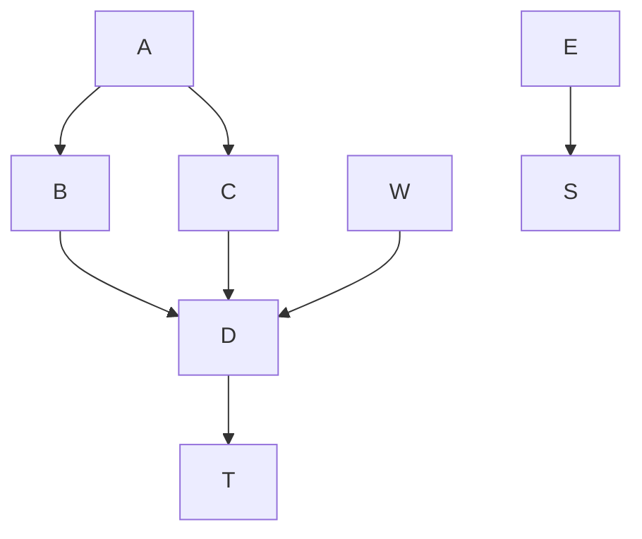
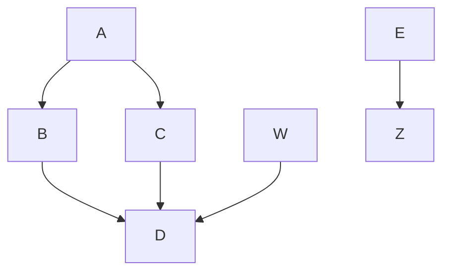

# package a chart directory into a chart archive
```
helm package aibot/ fbuilder/ flowbot/ sscreen/
```

# helm repo add

$ helm repo add mpodman https://motebus.github.io/charts/


# Test this out

Here is an inline mermaid file



Goal: comment out the above, insert image ref


