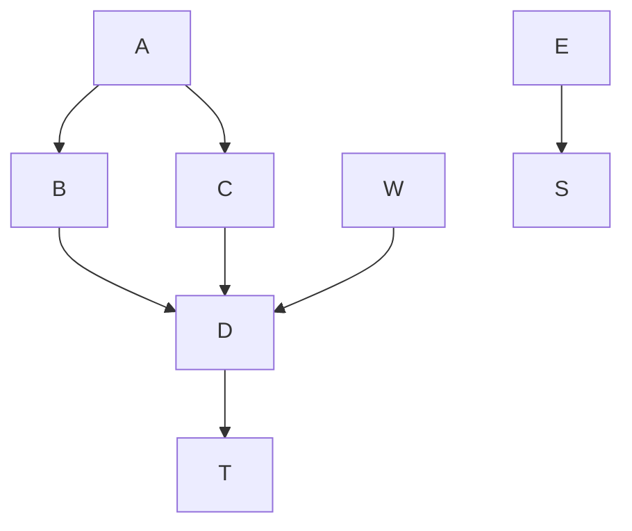
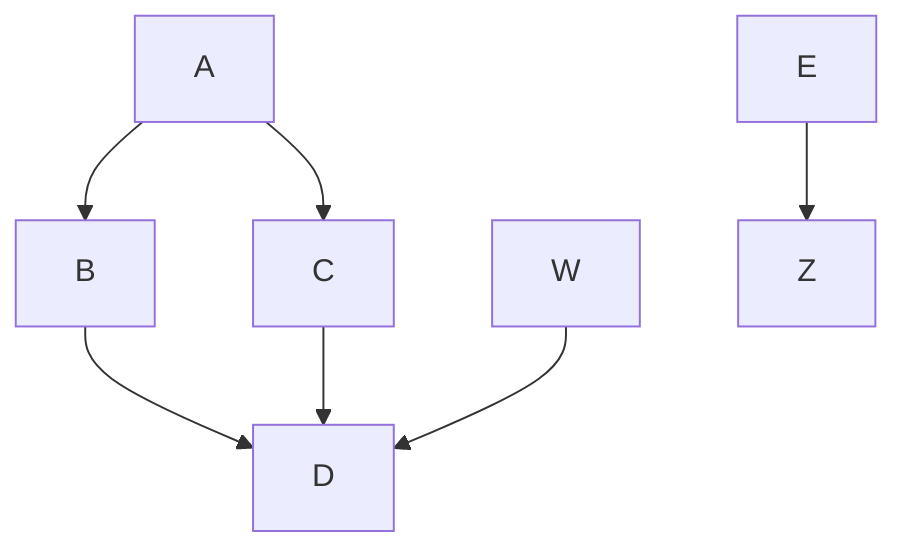

# package a chart directory into a chart archive
```
helm package aibot/ fbuilder/ flowbot/ sscreen/
```

# helm repo add

$ helm repo add mpodman https://motebus.github.io/charts/


# Test this out

Here is an inline mermaid file



Goal: comment out the above, insert image ref



  ```mermaid
  sequenceDiagram
  participant U as User
  participant C as Client
  participant S as Server
  participant DB as Database

  U ->> C: Fill username
  U ->> C: Fill password
  C ->> U: Enable "Login" button
  U ->> C: Click "Login" button
  C ->>+ S: POST /login
  S ->>+ DB: SELECT FROM users
  Note over S,DB: See login.py for impl. details
  DB -->>- S: results
  S -->>- C: { authenticated: true }
  C ->> U: redirect /home
  ```
